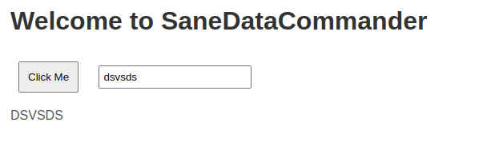
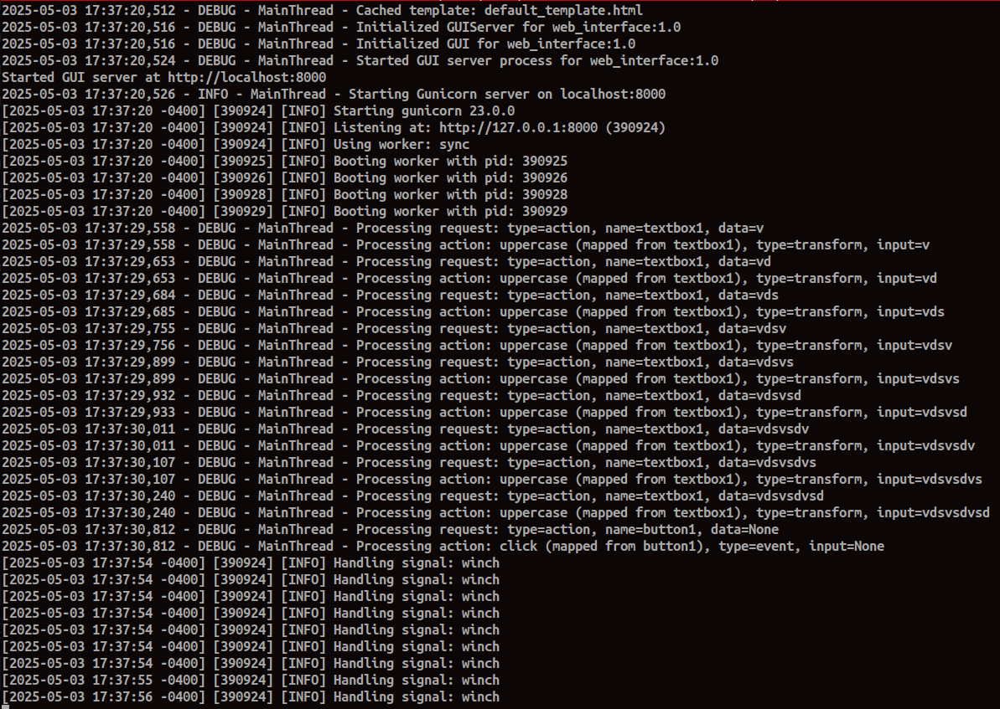

# Sane Data Commander

Sane Data Commander is a versatile Python application framework designed to provide modular, plug-and-play components for diverse application needs. It includes a database abstraction layer for seamless management across multiple database systems, a cryptographic network abstraction layer for secure data tunneling, an MVC-capable web framework with file-based action configurations, and the innovative Distributor technology for exporting logic, settings, data, and processes to files. This unified interface simplifies complex tasks across database operations, secure networking, and web-based user interfaces.

This provides for platform and service agnostic HTML applications served over HTTP or HTTPS.

More features, dialects, and integrations are forthcoming in upcoming versions, so stay tuned for updates! 📢

**TLDR**: Running `python Test_UDC.py`, `python Test_Network.py`, `python Test_UDO.py`, or `python Test_FWC.py` provides trivial usage examples for the database, network, and controller components. Run `python RunGUIServer.py` to launch the GUI web interface and show trivial configurations from the csv config files.

## Components

### Universal Database Connector (UDC)


The Universal Database Connector (UDC) is a Python library that provides a database-agnostic layer for Sane Data Commander, enabling seamless integration with multiple database systems (currently SQLite and MySQL, with more to come). It supports connection pooling, dialect-agnostic SQL generation, and configuration management, making it ideal for plugging into application frameworks requiring robust database operations.

#### Features
- **Universal Connectivity**: Supports SQLite and MySQL through a single interface, with plans for additional databases.
- **Connection Pooling**: Efficiently manages database connections with thread-safe pooling.
- **Dialect-Agnostic SQL**: Generates SQL queries compatible with different database systems using the `SQLMaker` class.
- **Configuration Management**: Loads and stores database configurations from CSV files into SQLite.
- **Thread-Safe Operations**: Ensures safe concurrent access with thread-local storage and locking.
- **Comprehensive Logging**: Detailed logs for debugging and monitoring operations.

#### Installation

1. Clone the Sane Data Commander repository:
   ```bash
   git clone https://github.com/ThreadDotRun/SaneDataCommander.git
   cd SaneDataCommander
   ```

2. Create a virtual environment (optional but recommended):
   ```bash
   python -m venv venv
   source venv/bin/activate  # On Windows: venv\Scripts\activate
   ```

3. Install dependencies:
   ```bash
   pip install -r requirements.txt
   ```

   Ensure you have the following dependencies in `requirements.txt` for the UDC:
   ```
   pymysql>=1.0.2
   ```

   `python --version` 3.10.12 or better

4. (Optional) Install database drivers:
   - For MySQL: Ensure a MySQL server is running.
   - For SQLite: No additional drivers needed (included with Python).

#### Usage

The `Test_UDC.py` script demonstrates how to use the UDC component to perform CRUD operations on a SQLite database within the Sane Data Commander framework. Below is an example:

1. Create a configuration CSV file (`configs.csv`):
   ```csv
   service_type,service_name,version,settings
   database,test_db,1.0,"{""driver"": ""sqlite3"", ""db_path"": ""test.db""}"
   ```

2. Run the test script:
   ```bash
   python Test_UDC.py
   ```

   This will:
   - Load configurations from `configs.csv`.
   - Create a `users` table.
   - Insert, select, update, and delete data.
   - Log all operations and close connections.

Example code snippet from `Test_UDC.py`:
```python
from UniversalDatabaseConnector import UniversalDatabaseConnector, DatabaseOperations

# Initialize connector and operations
connector = UniversalDatabaseConnector(db_path="configs.db")
connector.load_configs("configs.csv")
db_ops = DatabaseOperations(connector=connector, service_name="test_db", version="1.0")

# Create a table
db_ops.create_table(
    table_name="users",
    columns={"id": "INTEGER PRIMARY KEY AUTOINCREMENT", "name": "TEXT"},
    if_not_exists=True
)

# Insert data
db_ops.insert(table_name="users", data={"name": "Alice"})

# Select data
result = db_ops.select(table_name="users", columns=["id", "name"], where={"name": "Alice"})
print(result)
```

### Secure Network Communication

📢❗🚨 New!


The Secure Network Communication components provide a modular framework for encrypted data transmission over TCP sockets, integrating seamlessly with the Sane Data Commander ecosystem. These components reuse the `Distributor` class for configuration management, ensuring consistency with the UDC. The components are designed for client/server architectures, with encryption handled independently of the underlying socket connection.

#### Components Overview
- **Crypto**: Handles message cryptography using a configurable encryption/decryption config file based mechanism and routes encryption on the fly. Configurations are managed via `Distributor`.
- **NetworkSocketConnector**: Establishes unencrypted TCP socket connections (client or server), configurable via `Distributor` for host, port, and role.
- **SecureDataTransmitter**: Manages encrypted data transmission over sockets created by `NetworkSocketConnector`, using `Crypto` to encrypt data before sending and decrypt after receiving.

#### Features
- **Configurable Cryptography**: Supports multiple encryption methods (XOR, AES-CBC, AES-GCM) via plugins, configured through `Distributor`.
- **Flexible Socket Connections**: Supports both client and server roles with configurable connection parameters (host, port).
- **Encrypted Data Transmission**: Ensures all data sent or received is encrypted, independent of the socket’s transport layer.
- **Thread-Safe Operations**: Leverages thread-safe configuration management via `Distributor`.
- **Comprehensive Logging**: Detailed logs for debugging and monitoring network and crypto operations.

#### Installation

1. Ensure the Sane Data Commander repository is cloned and dependencies are installed (see UDC Installation).
2. Install additional dependencies for cryptography:
   ```text
   cryptography>=3.4.8
   pycryptodome>=3.10.1
   ```

#### Usage

The components are configured via a CSV file managed by `Distributor`. Below is an example of setting up a server and client for encrypted communication:

1. Create a configuration CSV file (`network_configs.csv`):
   ```csv
   service_type,service_name,version,settings
   network,server,1.0,"{""role"": ""server"", ""host"": ""localhost"", ""port"": 5000, ""crypto"": {""type"": ""xor"", ""params"": {""byte"": 42}}}"
   network,client,1.0,"{""role"": ""client"", ""host"": ""localhost"", ""port"": 5000, ""crypto"": {""type"": ""xor"", ""params"": {""byte"": 42}}}"
   ```

2. Run a server script (e.g., `server.py`):
   ```python
   from Distributor import Distributor
   from Crypto import Crypto
   from NetworkSocketConnector import NetworkSocketConnector
   from SecureDataTransmitter import SecureDataTransmitter

   distributor = Distributor(db_path="network_configs.db")
   distributor.getConfigsFromDelimtedFile("network_configs.csv")
   crypto = Crypto(distributor, service_name="server", version="1.0")
   connector = NetworkSocketConnector(distributor, service_name="server", version="1.0")
   transmitter = SecureDataTransmitter(connector, crypto)

   socket = connector.connect()
   transmitter.start_server(socket)
   ```

3. Run a client script (e.g., `client.py`):
   ```python
   from Distributor import Distributor
   from Crypto import Crypto
   from NetworkSocketConnector import NetworkSocketConnector
   from SecureDataTransmitter import SecureDataTransmitter

   distributor = Distributor(db_path="network_configs.db")
   distributor.getConfigsFromDelimtedFile("network_configs.csv")
   crypto = Crypto(distributor, service_name="client", version="1.0")
   connector = NetworkSocketConnector(distributor, service_name="client", version="1.0")
   transmitter = SecureDataTransmitter(connector, crypto)

   socket = connector.connect()
   response = transmitter.send_data(socket, b"Hello, Server!")
   print(f"Received: {response.decode()}")
   socket.close()
   ```

   This will:
   - Load configurations from `network_configs.csv`.
   - Establish a server or client socket connection.
   - Send/receive encrypted data using XOR encryption (byte 42).
   - Log all operations.

#### Testing

To verify the functionality of the Secure Network Communication components, run:
```bash
python Test_Network.py
```

Ensure `network_configs.csv` is present and dependencies are installed.

#### Dependencies
- Python >= 3.8
- `cryptography>=3.4.8`
- `pycryptodome>=3.10.1`

#### Project Structure (Secure Network Communication)
```
SaneDataCommander/
├── Crypto.py                 # Handles message cryptography
├── NetworkSocketConnector.py # Establishes TCP socket connections
├── SecureDataTransmitter.py  # Manages encrypted data transmission
├── Test_Network.py           # Test script for network components
└── ...
```

### GUI Server

📢❗🚨 New!

 (Trivial Example View Only ATM)

The GUI Server component provides a web-based interface for Sane Data Commander, built with Flask and Gunicorn. It serves HTML templates, processes user interactions (e.g., button clicks, text inputs), and executes actions configured via CSV files and `gui_action_configs.txt`. The component integrates with the `Distributor` for configuration management, ensuring consistency with other Sane Data Commander components.

#### Components Overview
- **GUIServer**: Manages the Flask application, defines routes, handles rate limiting, and coordinates template and action processing.
- **TemplateProcessor**: Loads and processes HTML templates, replacing custom tags with dynamic content.
- **ActionProcessor**: Handles UI actions (e.g., text transformations, button events) based on configurations from `gui_action_configs.txt` and `configs.csv`.

#### Features
- **Web Interface**: Serves dynamic HTML pages with configurable templates and CSS.
- **Action Processing**: Supports transform actions (e.g., uppercase, reverse text) and event actions (e.g., button click responses).
- **Rate Limiting**: Enforces a maximum of 100 requests per second per client to prevent abuse.
- **Template Caching**: Caches HTML and CSS files in memory for performance, with thread-safe access.
- **Configuration Management**: Uses `Distributor` to load configurations from `configs.csv`, including UI-to-action mappings.
- **Thread-Safe Operations**: Ensures safe concurrent access with thread-local storage and locking.
- **Comprehensive Logging**: Detailed logs for debugging and monitoring operations.

#### Installation

1. Ensure the Sane Data Commander repository is cloned and dependencies are installed (see UDC Installation).
2. Install additional dependencies for the GUI Server:
   ```text
   flask>=2.0.0
   gunicorn>=20.1.0
   ```

3. Ensure the `assets/html_templates` directory contains `default_template.html` and `default_template.css`.

#### Usage

The GUI Server is configured via `configs.csv` and `gui_action_configs.txt`. Below is an example of setting up and running the server:

1. Create a configuration CSV file (`configs.csv`):
   ```csv
   service_type,service_name,version,settings
   gui,web_interface,1.0,"{""host"": ""localhost"", ""port"": 8000, ""template"": ""default_template.html"", ""actions"": {""button1"": ""click"", ""textbox1"": ""uppercase""}}"
   ```

2. Create an action configuration file (`gui_action_configs.txt`):
   ```text
   action_id,type,logic
   uppercase,transform,{"function": "upper"}
   reverse,transform,{"function": "reverse"}
   click,event,{"response": "Button {action_id} clicked"}
   ```

3. Run the GUI Server:
   ```bash
   python RunGUIServer.py
   ```

   This will:
   - Load configurations from `configs.csv` and `gui_action_configs.txt`.
   - Start a Gunicorn server on `localhost:8000`.
   - Serve the default template (`default_template.html`) with a button and text input.
   - Process actions (e.g., clicking the button displays "Button button1 clicked", typing in the text box converts input to uppercase).

4. Access the interface by navigating to `http://localhost:8000` in a web browser.

Example code snippet from `RunGUIServer.py`:
```python
from Distributor import Distributor
from GUIServer import GUIServer

distributor = Distributor("configs.db")
gui_server = GUIServer(distributor, "web_interface", "1.0")
gui_server.start_server()
```

#### Testing

To verify the GUI Server functionality, manually test the interface:
1. Open `http://localhost:8000` in a browser.
2. Click the "Click Me" button to see the response "Button button1 clicked".
3. Type text in the input field to see it converted to uppercase in the result div.

Ensure `configs.csv` and `gui_action_configs.txt` are present and dependencies are installed.

#### Dependencies
- Python >= 3.8
- `flask>=2.0.0`
- `gunicorn>=20.1.0`

#### Project Structure (GUI Server)
```
SaneDataCommander/
├── GUIServer.py              # Manages the Flask-based GUI server
├── RunGUIServer.py           # Entry point to start the GUI server
├── gui_action_configs.txt    # Action configurations for UI interactions
├── assets/
│   ├── html_templates/
│   │   ├── default_template.html  # Default HTML template
│   │   ├── default_template.css   # Default CSS styles
└── ...
```

### Framework Controller

📢❗🚨 New!



The Framework Controller is the central orchestrator of the Sane Data Commander ecosystem, providing a high-level interface to manage database operations, secure network communication, and web-based GUI services. It integrates all major components (UDC, Secure Network Communication, GUI Server) using the `Distributor` for configuration management, enabling seamless interaction across services with thread-safe operations.

#### Components Overview
- **FrameworkController**: Coordinates initialization, configuration, and operation of database, network, and GUI components. It provides methods for CRUD operations, network communication, and GUI server management.
- **Distributor**: Used internally by the FrameworkController to load and manage configurations from CSV files for all services.
- **UniversalDatabaseConnector** and **DatabaseOperations**: Handle database connectivity and operations.
- **Crypto**, **NetworkSocketConnector**, and **SecureDataTransmitter**: Manage encrypted network communication.
- **GUIServer**: Manages the web-based interface.

#### Features
- **Unified Interface**: Simplifies interaction with database, network, and GUI services through a single class.
- **Configuration Management**: Loads configurations from `configs.csv` and `gui_action_configs.txt` via `Distributor`.
- **Thread-Safe Operations**: Uses thread locks to ensure safe concurrent access to components.
- **Modular Integration**: Seamlessly integrates with existing Sane Data Commander components.
- **Comprehensive Logging**: Detailed logs for debugging and monitoring all operations.
- **Scalable Architecture**: Supports both client and server network roles and multiple database dialects.

#### Installation

1. Ensure the Sane Data Commander repository is cloned and dependencies are installed (see UDC Installation).
2. Install all required dependencies for the Framework Controller, which includes dependencies for database, network, and GUI components:
   ```text
   mysql-connector-python>=8.0.0
   psycopg2-binary>=2.9.0
   pymysql>=1.0.2
   cryptography>=3.4.8
   pycryptodome>=3.10.1
   flask>=2.0.0
   gunicorn>=20.1.0
   ```

3. Ensure the `assets/html_templates` directory contains `default_template.html` and `default_template.css`.

#### Usage

The Framework Controller is configured via `configs.csv` for database, network, and GUI services. The `Test_FWC.py` script demonstrates its usage for initializing components, performing database operations, starting a network server, sending encrypted data, and launching the GUI.

1. Create a configuration CSV file (`configs.csv`):
   ```csv
   service_type,service_name,version,settings   settings
   database,test_db,1.0,"{""driver"": ""sqlite3"", ""db_path"": ""test.db""}"
   gui,web_interface,1.0,"{""host"": ""localhost"", ""port"": 8000, ""template"": ""default_template.html"", ""actions"": {""button1"": ""click"", ""textbox1"": ""uppercase""}}"
   network,server,1.0,"{""role"": ""server"", ""host"": ""localhost"", ""port"": 5000, ""crypto"": {""type"": ""xor"", ""params"": {""byte"": 42}}}"
   network,client,1.0,"{""role"": ""client"", ""host"": ""localhost"", ""port"": 5000, ""crypto"": {""type"": ""xor"", ""params"": {""byte"": 42}}}"
   ```

2. Run the test script:
   ```bash
   python Test_FWC.py
   ```

   This will:
   - Load configurations for all services.
   - Initialize database, network, and GUI components.
   - Create a `users` table and perform CRUD operations.
   - Start a network server and send encrypted data.
   - Launch the GUI server at `http://localhost:8000`.

Example code snippet from `Test_FWC.py`:
```python
from FrameworkController import FrameworkController

# Initialize the controller
controller = FrameworkController()

# Load configurations
controller.load_configs()

# Initialize database
controller.initialize_database()

# Create a table
columns = {"id": "INTEGER PRIMARY KEY AUTOINCREMENT", "name": "TEXT"}
controller.create_table("users", columns, primary_key="id")

# Insert data
controller.insert_data("users", {"name": "Alice"})

# Select data
result = controller.select_data("users", columns=["id", "name"], where={"name": "Alice"})

# Initialize network
controller.initialize_network()

# Start network server
controller.start_network_server()

# Send network data
response = controller.send_network_data(b"Hello, Server!")

# Initialize GUI
controller.initialize_gui()

# Start GUI server
controller.start_gui_server()
```

#### Testing

To verify the Framework Controller functionality:
1. Run `python Test_FWC.py` to execute the full workflow (database operations, network communication, GUI server).
2. Access `http://localhost:8000` to interact with the GUI, clicking the button to see "Button button1 clicked" or typing in the text box to convert input to uppercase.
3. Monitor logs to verify network and database operations.

Ensure `configs.csv` and `gui_action_configs.txt` are present and dependencies are installed.

#### Dependencies
- Python >= 3.8
- `mysql-connector-python>=8.0.0`
- `psycopg2-binary>=2.9.0`
- `pymysql>=1.0.2`
- `cryptography>=3.4.8`
- `pycryptodome>=3.10.1`
- `flask>=2.0.0`
- `gunicorn>=20.1.0`

#### Project Structure (Framework Controller)
```
SaneDataCommander/
├── FrameworkController.py     # High-level controller for all components
├── Test_FWC.py               # Test script for FrameworkController
├── configs.csv               # Configuration for all services
├── gui_action_configs.txt    # GUI action configurations
└── ...
```

## API Documentation

<small>

Below is the detailed API documentation for the key classes and methods in Sane Data Commander, including input parameters, types, outputs, types, and expected data.

### Universal Database Connector (UDC)

#### Class: `Distributor`
Manages configuration storage and retrieval using SQLite and CSV files.

- **__init__(db_path: str = "configs.db") -> None**
  - **Parameters**:
    - `db_path: str` - Path to the SQLite database for storing configurations (default: `"configs.db"`).
  - **Returns**: None
  - **Description**: Initializes an SQLite database with a `configurations` table if it doesn’t exist. Logs initialization status.
  - **Example**:
    ```pytest
    distributor = Distributor("configs.db")
    ```

- **getConfigsFromDelimtedFile(file_path: str) -> bool**
  - **Parameters**:
    - `file_path: str` - Path to a CSV file containing configuration data.
  - **Returns**: `bool` - `True` if configurations are loaded successfully, `False` otherwise.
  - **Description**: Loads configurations from a CSV with columns `service_type`, `service_name`, `version`, `settings` (JSON string). Stores configurations in memory.
  - **Example**:
    ```python
    distributor.getConfigsFromDelimtedFile("configs.csv")
    ```
    ```csv
    service_type,service_name,version,settings
    database,test_db,1.0,"{""driver"": ""sqlite3"", ""db_path"": ""test.db""}"
    ```

- **storeConfigsInSQLite() -> bool**
  - **Parameters**: None
  - **Returns**: `bool` - `True` if configurations are stored in SQLite, `False` otherwise.
  - **Description**: Stores in-memory configurations into the SQLite database’s `configurations` table.
  - **Example**:
    ```python
    distributor.storeConfigsInSQLite()
    ```

- **GetConfigureation(service: str, name: str, version: str) -> Optional[str]**
  - **Parameters**:
    - `service: str` - Service type (e.g., `"database"`).
    - `name: str` - Service name (e.g., `"test_db"`).
    - `version: str` - Configuration version (e.g., `"1.0"`).
  - **Returns**: `Optional[str]` - JSON string of the configuration if found, `None` otherwise.
  - **Description**: Retrieves configuration from memory or SQLite.
  - **Example**:
    ```python
    config = distributor.GetConfigureation("database", "test_db", "1.0")
    # Returns: "{""service_type"": ""database"", ""service_name"": ""test_db"", ""version"": ""1.0"", ""settings"": {""driver"": ""sqlite3"", ""db_path"": ""test.db""}}"
    ```

- **addConfiguration(config: Dict[str, Any]) -> bool**
  - **Parameters**:
    - `config: Dict[str, Any]` - Configuration dictionary with keys `service_type`, `service_name`, `version`, `settings`.
  - **Returns**: `bool` - `True` if configuration is added, `False` otherwise.
  - **Description**: Adds configuration to memory and SQLite.
  - **Example**:
    ```python
    config = {"service_type": "database", "service_name": "test_db", "version": "1.0", "settings": {"driver": "sqlite3", "db_path": "test.db"}}
    distributor.addConfiguration(config)
    ```

#### Class: `DBConnectionPool`
Manages a pool of database connections.

- **__init__(max_connections: int = 10) -> None**
  - **Parameters**:
    - `max_connections: int` - Maximum number of connections in the pool (default: `10`).
  - **Returns**: None
  - **Description**: Initializes an empty connection pool with a thread-safe queue.
  - **Example**:
    ```python
    pool = DBConnectionPool(max_connections=5)
    ```

- **initialize_pool(config: Dict[str, Any], driver: str) -> None**
  - **Parameters**:
    - `config: Dict[str, Any]` - Configuration dictionary with `settings` key containing driver-specific connection details.
    - `driver: str` - Database driver (e.g., `"sqlite3"`, `"pymysql"`).
  - **Returns**: None
  - **Description**: Populates the pool with connections based on the driver and configuration. Raises an exception on failure.
  - **Example**:
    ```python
    config = {"settings": {"db_path": "test.db"}}
    pool.initialize_pool(config, "sqlite3")
    ```

- **get_connection() -> Any**
  - **Parameters**: None
  - **Returns**: `Any` - A database connection object (e.g., `sqlite3.Connection`, `pymysql.connections.Connection`).
  - **Description**: Retrieves a connection from the pool or creates a new one if the pool is empty and under capacity. Raises `RuntimeError` if no connections are available after a timeout.
  - **Example**:
    ```python
    conn = pool.get_connection()
    ```

- **release_connection(conn: Any) -> None**
  - **Parameters**:
    - `conn: Any` - Database connection object to return to the pool.
  - **Returns**: None
  - **Description**: Returns the connection to the pool if space is available; otherwise, retains the connection without closing it. Logs warnings or errors if the pool is full or an issue occurs.
  - **Example**:
    ```python
    pool.release_connection(conn)
    ```

#### Class: `UniversalDatabaseConnector`
Handles database connections with thread-safe pooling.

- **__init__(db_path: str = "configs.db") -> None**
  - **Parameters**:
    - `db_path: str` - Path to the SQLite database for configurations (default: `"configs.db"`).
  - **Returns**: None
  - **Description**: Initializes a `Distributor` instance and sets up thread-local storage for connections.
  - **Example**:
    ```python
    connector = UniversalDatabaseConnector("configs.db")
    ```

- **load_configs(file_path: str) -> bool**
  - **Parameters**:
    - `file_path: str` - Path to the CSV file with configurations.
  - **Returns**: `bool` - `True` if configurations are loaded and stored, `False` otherwise.
  - **Description**: Loads configurations via `Distributor.getConfigsFromDelimtedFile` and stores them via `storeConfigsInSQLite`.
  - **Example**:
    ```python
    connector.load_configs("configs.csv")
    ```

- **connect(service_name: str, version: str = "1.0") -> bool**
  - **Parameters**:
    - `service_name: str` - Name of the database service (e.g., `"test_db"`).
    - `version: str` - Configuration version (default: `"1.0"`).
  - **Returns**: `bool` - `True` if connection is established, `False` otherwise.
  - **Description**: Creates a connection pool for the specified service and assigns a connection to the current thread. Supports drivers: `sqlite3`, `pymysql`.
  - **Example**:
    ```python
    connector.connect("test_db", "1.0")
    ```

- **execute_query(query: str, params: Optional[Union[Tuple, List]] = None) -> Optional[Any]**
  - **Parameters**:
    - `query: str` - SQL query to execute.
    - `params: Optional[Union[Tuple, List]]` - Query parameters for parameterized queries (default: `None`).
  - **Returns**: `Optional[Any]` - For `SELECT` queries, returns a list of rows; for other queries, returns `True` on success, `None` on failure.
  - **Description**: Executes the query on the thread-local connection, commits on success, rolls back on failure.
  - **Example**:
    ```python
    result = connector.execute_query("SELECT id, name FROM users WHERE name = ?", ["Alice"])
    # Returns: [(1, "Alice")]
    ```

- **close() -> None**
  - **Parameters**: None
  - **Returns**: None
  - **Description**: Closes all connection pools and clears thread-local connections.
  - **Example**:
    ```python
    connector.close()
    ```

#### Class: `SQLMaker`
Generates dialect-agnostic SQL statements.

- **__init__(dialect: str = "generic") -> None**
  - **Parameters**:
    - `dialect: str` - Database dialect (`sqlite`, `mysql`, `postgresql`, or `generic`; default: `"generic"`).
  - **Returns**: None
  - **Description**: Initializes SQL generation for the specified dialect.
  - **Example**:
    ```python
    sql_maker = SQLMaker("sqlite")
    ```

- **create_table(table_name: str, columns: Dict[str, str], primary_key: Optional[Union[str, List[str]]] = None, if_not_exists: bool = True) -> str**
  - **Parameters**:
    - `table_name: str` - Name of the table to create.
    - `columns: Dict[str, str]` - Dictionary of column names to SQL data types.
    - `primary_key: Optional[Union[str, List[str]]]` - Column(s) for the primary key.
    - `if_not_exists: bool` - Add `IF NOT EXISTS` clause.
  - **Returns**: `str` - SQL `CREATE TABLE` statement.
  - **Description**: Generates a `CREATE TABLE` statement.
  - **Example**:
    ```python
    sql = sql_maker.create_table("users", {"id": "INTEGER", "name": "TEXT"}, primary_key="id")
    # Returns: "CREATE TABLE IF NOT EXISTS users (id INTEGER, name TEXT, PRIMARY KEY (id))"
    ```

- **drop_table(table_name: str, if_exists: bool = True) -> str**
  - **Parameters**:
    - `table_name: str` - Name of the table to drop.
    - `if_exists: bool` - Add `IF EXISTS` clause.
  - **Returns**: `str` - SQL `DROP TABLE` statement.
  - **Description**: Generates a `DROP TABLE` statement.
  - **Example**:
    ```python
    sql = sql_maker.drop_table("users")
    # Returns: "DROP TABLE IF EXISTS users"
    ```

- **create_index(index_name: str, table_name: str, columns: Union[str, List[str]], unique: bool = False) -> str**
  - **Parameters**:
    - `index_name: str` - Name of the index.
    - `table_name: str` - Table to create the index on.
    - `columns: Union[str, List[str]]` - Column(s) to index.
    - `unique: bool` - Create a unique index.
  - **Returns**: `str` - SQL `CREATE INDEX` statement.
  - **Description**: Generates a `CREATE INDEX` statement.
  - **Example**:
    ```python
    sql = sql_maker.create_index("idx_name", "users", "name")
    # Returns: "CREATE INDEX idx_name ON users (name)"
    ```

- **insert(table_name: str, data: Dict[str, Any]) -> Tuple[str, Tuple[Any, ...]]**
  - **Parameters**:
    - `table_name: str` - Name of the table to insert into.
    - `data: Dict[str, Any]` - Dictionary of column names to values.
  - **Returns**: `Tuple[str, Tuple[Any, ...]]` - SQL `INSERT` statement and parameter values.
  - **Description**: Generates an `INSERT` statement with parameters.
  - **Example**:
    ```python
    sql, params = sql_maker.insert("users", {"name": "Alice"})
    # Returns: ("INSERT INTO users (name) VALUES (?)", ("Alice",))
    ```

- **bulk_insert(table_name: str, data: List[Dict[str, Any]]) -> Tuple[str, List[Tuple[Any, ...]]]** 
  - **Parameters**:
    - `table_name: str` - Name of the table to insert into.
    - `data: List[Dict[str, Any]]` - List of dictionaries with column names to values.
  - **Returns**: `Tuple[str, List[Tuple[Any, ...]]]` - SQL `INSERT` statement and list of parameter tuples.
  - **Description**: Generates a `INSERT` statement for multiple rows.
  - **Example**:
    ```python
    sql, params = sql_maker.bulk_insert("users", [{"name": "Alice"}, {"name": "Bob"}])
    # Returns: ("INSERT INTO users (name) VALUES (?)", [("Alice",), ("Bob",)])
    ```

- **select(table_name: str, columns: Union[str, List[str]] = "*", where: Optional[Dict[str, Any]] = None, order_by: Optional[Union[str, List[str]]] = None, limit: Optional[int] = None) -> Tuple[str, List[Any]]**
  - **Parameters**:
    - `table_name: str` - Name of the table to select from.
    - `columns: Union[str, List[str]]` - Columns to select.
    - `where: Optional[Dict[str, Any]]` - Conditions for the `WHERE` clause.
    - `order_by: Optional[Union[str, List[str]]]` - Columns to order by.
    - `limit: Optional[int]` - Maximum rows to return.
  - **Returns**: `Tuple[str, List[Any]]` - SQL `SELECT` statement and parameter values.
  - **Description**: Generates a `SELECT` statement with parameters.
  - **Example**:
    ```python
    sql, params = sql_maker.select("users", columns=["id", "name"], where={"name": "Alice"})
    # Returns: ("SELECT id, name FROM users WHERE name = ?", ["Alice"])
    ```

- **update(table_name: str, data: Dict[str, Any], where: Optional[Dict[str, Any]] = None) -> Tuple[str, List[Any]]**
  - **Parameters**:
    - `table_name: str` - Name of the table to update.
    - `data: Dict[str, Any]` - Dictionary of column names to new values.
    - `where: Optional[Dict[str, Any]]` - Conditions for the `WHERE` clause.
  - **Returns**: `Tuple[str, List[Any]]` - SQL `UPDATE` statement and parameter values.
  - **Description**: Generates an `UPDATE` statement with parameters.
  - **Example**:
    ```python
    sql, params = sql_maker.update("users", {"name": "Bob"}, {"id": 1})
    # Returns: ("UPDATE users SET name = ? WHERE id = ?", ["Bob", 1])
    ```

- **delete(table_name: str, where: Optional[Dict[str, Any]] = None) -> Tuple[str, List[Any]]**
  - **Parameters**:
    - `table_name: str` - Name of the table to delete from.
    - `where: Optional[Dict[str, Any]]` - Conditions for the `WHERE` clause.
  - **Returns**: `Tuple[str, List[Any]]` - SQL `DELETE` statement and parameter values.
  - **Description**: Generates a `DELETE` statement with parameters.
  - **Example**:
    ```python
    sql, params = sql_maker.delete("users", {"name": "Alice"})
    # Returns: ("DELETE FROM users WHERE name = ?", ["Alice"])
    ```

#### Class: `DatabaseOperations`
Provides high-level database operations (CRUD) using `SQLMaker`.

- **__init__(connector: UniversalDatabaseConnector, service_name: str, version: str = "1.0", dialect: str = "generic") -> None**
  - **Parameters**:
    - `connector: UniversalDatabaseConnector` - Instance of the connector.
    - `service_name: str` - Name of the database service.
    - `version: str` - Configuration version.
    - `dialect: str` - SQL dialect for `SQLMaker`.
  - **Returns**: None
  - **Description**: Initializes with a connector and a `SQLMaker` instance for the specified dialect.
  - **Example**:
    ```python
    db_ops = DatabaseOperations(connector, "test_db", "1.0", "sqlite")
    ```

- **connect() -> bool**
  - **Parameters**: None
  - **Returns**: `bool` - `True` if connection is established, `False` otherwise.
  - **Description**: Calls `connector.connect` to establish a connection.
  - **Example**:
    ```python
    db_ops.connect()
    ```

- **create_table(table_name: str, columns: Dict[str, str], primary_key: Optional[Union[str, List[str]]] = None, if_not_exists: bool = True) -> bool**
  - **Parameters**:
    - `table_name: str` - Name of the table to create.
    - `columns: Dict[str, str]` - Dictionary of column names to SQL data types.
    - `primary_key: Optional[Union[str, List[str]]]` - Column(s) for the primary key.
    - `if_not_exists: bool` - Add `IF NOT EXISTS` clause.
  - **Returns**: `bool` - `True` if table is created, `False` otherwise.
  - **Description**: Creates a table with the specified columns and primary key.
  - **Example**:
    ```python
    db_ops.create_table("users", {"id": "INTEGER", "name": "TEXT"}, primary_key="id")
    ```

- **drop_table(table_name: str, if_exists: bool = True) -> bool**
  - **Parameters**:
    - `table_name: str` - Name of the table to drop.
    - `if_exists: bool` - Add `IF EXISTS` clause.
  - **Returns**: `bool` - `True` if table is dropped, `False` otherwise.
  - **Description**: Drops the specified table.
  - **Example**:
    ```python
    db_ops.drop_table("users")
    ```

- **create_index(index_name: str, table_name: str, columns: Union[str, List[str]], unique: bool = False) -> bool**
  - **Parameters**:
    - `index_name: str` - Name of the index.
    - `table_name: str` - Table to create the index on.
    - `columns: Union[str, List[str]]` - Column(s) to index.
    - `unique: bool` - Create a unique index.
  - **Returns**: `bool` - `True` if index is created, `False` otherwise.
  - **Description**: Creates an index on the specified columns.
  - **Example**:
    ```python
    db_ops.create_index("idx_name", "users", "name")
    ```

- **insert(table_name: str, data: Dict[str, Any]) -> bool**
  - **Parameters**:
    - `table_name: str` - Name of the table to insert into.
    - `data: Dict[str, Any]` - Dictionary of column names to values.
  - **Returns**: `bool` - `True` if insertion succeeds, `False` otherwise.
  - **Description**: Inserts a single row into the table.
  - **Example**:
    ```python
    db_ops.insert("users", {"name": "Alice"})
    ```

- **bulk_insert(table_name: str, data: List[Dict[str, Any]]) -> bool**
  - **Parameters**:
    - `table_name: str` - Name of the table to insert into.
    - `data: List[Dict[str, Any]]` - List of dictionaries with column names to values.
  - **Returns**: `bool` - `True` if insertion succeeds, `False` otherwise.
  - **Description**: Inserts multiple rows. All dictionaries must have the same keys.
  - **Example**:
    ```python
    db_ops.bulk_insert("users", [{"name": "Alice"}, {"name": "Bob"}])
    ```

- **select(table_name: str, columns: Union[str, List[str]] = "*", where: Optional[Dict[str, Any]] = None, order_by: Optional[Union[str, List[str]]] = None, limit: Optional[int] = None) -> Optional[List[Dict[str, Any]]]**
  - **Parameters**:
    - `table_name: str` - Name of the table to select from.
    - `columns: Union[str, List[str]]` - Columns to select.
    - `where: Optional[Dict[str, Any]]` - Conditions for the `WHERE` clause.
    - `order_by: Optional[Union[str, List[str]]]` - Columns to order by.
    - `limit: Optional[int]` - Maximum rows to return.
  - **Returns**: `Optional[List[Dict[str, Any]]]` - List of dictionaries with results, or `None` on error.
  - **Description**: Selects rows from the table.
  - **Example**:
    ```python
    result = db_ops.select("users", columns=["id", "name"], where={"name": "Alice"})
    # Returns: [{"id": 1, "name": "Alice"}]
    ```

- **update(table_name: str, data: Dict[str, Any], where: Optional[Dict[str, Any]] = None) -> bool**
  - **Parameters**:
    - `table_name: str` - Name of the table to update.
    - `data: Dict[str, Any]` - Dictionary of column names to new values
  - **Returns**: `bool` - `True` if update succeeds, `False` otherwise.
  - **Description**: Updates rows matching the `where` conditions.
  - **Example**:
    ```python
    db_ops.update("users", {"name": "Bob"}, {"id": 1})
    ```

- **delete(table_name: str, where: Optional[Dict[str, Any]] = None) -> bool**
  - **Parameters**:
    - `table_name: str` - Name of the table to delete from.
    - `where: Optional[Dict[str, Any]]` - Conditions for the `WHERE` clause.
  - **Returns**: `bool` - `True` if deletion succeeds, `False` otherwise.
  - **Description**: Deletes rows matching the `where` conditions.
  - **Example**:
    ```python
    db_ops.delete("users", {"name": "Alice"})
    ```

- **close() -> None**
  - **Parameters**: None
  - **Returns**: None
  - **Description**: Closes all connection pools and thread-local connections.
  - **Example**:
    ```python
    db_ops.close()
    ```

### Secure Network Communication

#### Class: `Crypto`
Handles message cryptography with configurable encryption plugins.

- **__init__(distributor: Distributor, service_name: str, version: str = "1.0") -> None**
  - **Parameters**:
    - `distributor: Distributor` - Instance of the `Distributor` class.
    - `service_name: str` - Name of the network service (e.g., `"server"`, `"client"`).
    - `version: str` - Configuration version.
  - **Returns**: None
  - **Description**: Loads crypto configuration (e.g., XOR, AES-CBC, AES-GCM) from `Distributor`. Raises `ValueError` if configuration is invalid.
  - **Example**:
    ```python
    crypto = Crypto(distributor, "server", "1.0")
    ```

- **encrypt(data: bytes) -> bytes**
  - **Parameters**:
    - `data: bytes` - Data to encrypt.
  - **Returns**: `bytes` - Encrypted data.
  - **Description**: Encrypts data using the configured plugin (e.g., XOR, AES).
  - **Example**:
    ```python
    encrypted = crypto.encrypt(b"Hello")
    ```

- **decrypt(data: bytes) -> bytes**
  - **Parameters**:
    - `data: bytes` - Data to decrypt.
  - **Returns**: `bytes` - Decrypted data.
  - **Description**: Decrypts data using the configured plugin.
  - **Example**:
    ```python
    decrypted = crypto.decrypt(encrypted)
    ```

#### Class: `NetworkSocketConnector`
Establishes unencrypted TCP socket connections.

- **__init__(distributor: Distributor, service_name: str, version: str = "1.0") -> None**
  - **Parameters**:
    - `distributor: Distributor` - Instance of the `Distributor` class.
    - `service_name: str` - Name of the network service (e.g., `"server"`, `"client"`).
    - `version: str` - Configuration version.
  - **Returns**: None
  - **Description**: Initializes with configuration for establishing TCP connections.
  - **Example**:
    ```python
    connector = NetworkSocketConnector(distributor, "server", "1.0")
    ```

- **connect() -> socket.socket**
  - **Parameters**: None
  - **Returns**: `socket.socket` - A connected TCP socket (server returns client socket after accept).
  - **Description**: Establishes a TCP connection based on configuration (server or client).
  - **Example**:
    ```python
    socket = connector.connect()
    ```

- **receive_stream(sock: socket.socket, client_addr: tuple, buffer_size: int = 1024) -> Optional[bytes]**
  - **Parameters**:
    - `sock: socket.socket` - Connected socket to receive data from.
    - `client_addr: tuple` - Tuple of (host, port) for the client.
    - `buffer_size: int` - Maximum bytes to receive at once (default: 1024).
  - **Returns**: `Optional[bytes]` - Received data, or `None` if invalid or blocked.
  - **Description**: Receives data with security checks.
  - **Example**:
    ```python
    data = connector.receive_stream(socket, ("localhost", 5000))
    ```

- **send_stream(sock: socket.socket, data: bytes, client_addr: tuple) -> bool**
  - **Parameters**:
    - `sock: socket.socket` - Connected socket to send data over.
    - `data: bytes` - Data to send.
    - `client_addr: tuple` - Tuple of (host, port) for the client.
  - **Returns**: `bool` - `True` if sent successfully, `False` otherwise.
  - **Description**: Sends data with security checks.
  - **Example**:
    ```python
    connector.send_stream(socket, b"Hello", ("localhost", 5000))
    ```

#### Class: `SecureDataTransmitter`
Manages encrypted data transmission over sockets.

- **__init__(connector: NetworkSocketConnector, crypto: Crypto) -> None**
  - **Parameters**:
    - `connector: NetworkSocketConnector` - Instance for socket creation.
    - `crypto: Crypto` - Instance for encryption/decryption.
  - **Returns**: None
  - **Description**: Initializes with references to connector and crypto instances.
  - **Example**:
    ```python
    transmitter = SecureDataTransmitter(connector, crypto)
    ```

- **send_data(socket: socket.socket, data: bytes) -> bytes**
  - **Parameters**:
    - `socket: socket.socket` - Connected socket to send data over.
    - `data: bytes` - Data to encrypt and send.
  - **Returns**: `bytes` - Decrypted response from the peer (empty for servers).
  - **Description**: Encrypts data, sends it, and returns decrypted response.
  - **Example**:
    ```python
    response = transmitter.send_data(socket, b"Hello")
    ```

- **start_server(socket: socket.socket) -> None**
  - **Parameters**:
    - `socket: socket.socket` - Server socket to accept connections.
  - **Returns**: None
  - **Description**: Runs a server to receive and respond to encrypted client data.
  - **Example**:
    ```python
    transmitter.start_server(socket)
    ```

### GUI Server

#### Class: `GUIServer`
Manages the Flask-based GUI server.

- **__init__(distributor: Distributor, service_name: str, version: str) -> None**
  - **Parameters**:
    - `distributor: Distributor` - Instance for configuration management.
    - `service_name: str` - Name of the GUI service (e.g., `"web_interface"`).
    - `version: str` - Configuration version (e.g., `"1.0"`).
  - **Returns**: None
  - **Description**: Initializes the Flask app, template processor, action processor, and loads configurations.
  - **Example**:
    ```python
    gui_server = GUIServer(distributor, "web_interface", "1.0")
    ```

- **start_server() -> None**
  - **Parameters**: None
  - **Returns**: None
  - **Description**: Starts the Gunicorn server with configured host and port.
  - **Example**:
    ```python
    gui_server.start_server()
    ```

#### Class: `TemplateProcessor`
Handles HTML template loading and processing.

- **__init__(template_dir: str) -> None**
  - **Parameters**:
    - `template_dir: str` - Directory containing HTML templates and CSS.
  - **Returns**: None
  - **Description**: Initializes with the template directory.
  - **Example**:
    ```python
    processor = TemplateProcessor("./assets/html_templates")
    ```

- **load_template(template_name: str, cache: Dict[str, str], cache_lock: threading.Lock) -> str**
  - **Parameters**:
    - `template_name: str` - Name of the template file.
    - `cache: Dict[str, str]` - Dictionary for caching templates.
    - `cache_lock: threading.Lock` - Thread lock for cache access.
  - **Returns**: `str` - Template content as a string.
  - **Description**: Loads a template from cache or disk in a thread-safe manner.
  - **Example**:
    ```python
    template = processor.load_template("default_template.html", cache, cache_lock)
    ```

- **process_template(template_name: str, variables: Dict[str, str], functions: Dict[str, Callable], cache: Dict[str, str], cache_lock: threading.Lock) -> str**
  - **Parameters**:
    - `template_name: str` - Name of the template file.
    - `variables: Dict[str, str]` - Dictionary of variable names to values.
    - `functions: Dict[str, Callable]` - Dictionary of function names to callables.
    - `cache: Dict[str, str]` - Dictionary for caching templates.
    - `cache_lock: threading.Lock` - Thread lock for cache access.
  - **Returns**: `str` - Processed template content.
  - **Description**: Replaces tags in the template with variable or function values.
  - **Example**:
    ```python
    html = processor.process_template("default_template.html", {"app_name": "SaneDataCommander"}, {}, cache, cache_lock)
    ```

- **process_tag(tag: str, variables: Dict[str, str], functions: Dict[str, Callable]) -> str**
  - **Parameters**:
    - `tag: str` - Tag name to process.
    - `variables: Dict[str, str]` - Dictionary of variable names to values.
    - `functions: Dict[str, Callable]` - Dictionary of function names to callables.
  - **Returns**: `str` - Resolved tag value.
  - **Description**: Resolves a single tag to its corresponding value or function result.
  - **Example**:
    ```python
    value = processor.process_tag("app_name", {"app_name": "SaneDataCommander"}, {})
    ```

- **validate_template(template_content: str) -> bool**
  - **Parameters**:
    - `template_content: str` - HTML template content to validate.
  - **Returns**: `bool` - `True` if the template is valid HTML, `False` otherwise.
  - **Description**: Validates that the template is well-formed HTML.
  - **Example**:
    ```python
    is_valid = processor.validate_template("<html><body>Hello</body></html>")
    ```

#### Class: `ActionProcessor`
Handles UI actions based on configurations.

- **__init__(distributor: Distributor, service_name: str, version: str) -> None**
  - **Parameters**:
    - `distributor: Distributor` - Instance for configuration management.
    - `service_name: str` - Name of the GUI service.
    - `version: str` - Configuration version.
  - **Returns**: None
  - **Description**: Initializes with action configurations from `gui_action_configs.txt` and `configs.csv`.
  - **Example**:
    ```python
    processor = ActionProcessor(distributor, "web_interface", "1.0")
    ```

- **load_actions() -> None**
  - **Parameters**: None
  - **Returns**: None
  - **Description**: Loads action configurations from files and maps UI IDs to actions.
  - **Example**:
    ```python
    processor.load_actions()
    ```

- **process_action(action_id: str, input_data: Optional[str] = None) -> List[str]**
  - **Parameters**:
    - `action_id: str` - ID of the action to process.
    - `input_data: Optional[str]` - Optional input data for the action.
  - **Returns**: `List[str]` - List containing the result type and value (e.g., `["string", "HELLO"]`).
  - **Description**: Processes an action (transform or event) and returns the result.
  - **Example**:
    ```python
    result = processor.process_action("uppercase", "hello")
    # Returns: ["string", "HELLO"]
    ```

### Framework Controller

#### Class: `FrameworkController`
Orchestrates database, network, and GUI operations.

- **__init__() -> None**
  - **Parameters**: None
  - **Returns**: None
  - **Description**: Initializes with configuration paths for database, network, and GUI services.
  - **Example**:
    ```python
    controller = FrameworkController()
    ```

- **load_configs() -> bool**
  - **Parameters**: None
  - **Returns**: `bool` - `True` if configurations are loaded successfully, `False` otherwise.
  - **Description**: Loads configurations from `configs.csv` for all services.
  - **Example**:
    ```python
    controller.load_configs()
    ```

- **initialize_database() -> bool**
  - **Parameters**: None
  - **Returns**: `bool` - `True` if database initialization succeeds, `False` otherwise.
  - **Description**: Initializes database components for the `test_db` service.
  - **Example**:
    ```python
    controller.initialize_database()
    ```

- **initialize_network() -> bool**
  - **Parameters**: None
  - **Returns**: `bool` - `True` if network initialization succeeds, `False` otherwise.
  - **Description**: Initializes network components for `server` and `client` services.
  - **Example**:
    ```python
    controller.initialize_network()
    ```

- **initialize_gui() -> bool**
  - **Parameters**: None
  - **Returns**: `bool` - `True` if GUI initialization succeeds, `False` otherwise.
  - **Description**: Initializes GUI components for the `web_interface` service.
  - **Example**:
    ```python
    controller.initialize_gui()
    ```

- **create_table(table_name: str, columns: Dict[str, str], primary_key: Optional[Union[str, List[str]]] = None, if_not_exists: bool = True) -> bool**
  - **Parameters**:
    - `table_name: str` - Name of the table to create.
    - `columns: Dict[str, str]` - Dictionary of column names to SQL data types.
    - `primary_key: Optional[Union[str, List[str]]]` - Column(s) for the primary key.
    - `if_not_exists: bool` - Add `IF NOT EXISTS` clause.
  - **Returns**: `bool` - `True` if table creation succeeds, `False` otherwise.
  - **Description**: Creates a database table.
  - **Example**:
    ```python
    controller.create_table("users", {"id": "INTEGER", "name": "TEXT"}, primary_key="id")
    ```

- **insert_data(table_name: str, data: Union[Dict[str, Any], List[Dict[str, Any]]]) -> bool**
  - **Parameters**:
    - `table_name: str` - Name of the table to insert into.
    - `data: Union[Dict[str, Any], List[Dict[str, Any]]]` - Single dictionary or list of dictionaries with column names to values.
  - **Returns**: `bool` - `True` if insertion succeeds, `False` otherwise.
  - **Description**: Inserts single or multiple rows into a table.
  - **Example**:
    ```python
    controller.insert_data("users", {"name": "Alice"})
    ```

- **select_data(table_name: str, columns: Union[str, List[str]] = "*", where: Optional[Dict[str, Any]] = None, order_by: Optional[Union[str, List[str]]] = None, limit: Optional[int] = None) -> Optional[List[Dict[str, Any]]]**
  - **Parameters**:
    - `table_name: str` - Name of the table to select from.
    - `columns: Union[str, List[str]]` - Columns to select.
    - `where: Optional[Dict[str, Any]]` - Conditions for the `WHERE` clause.
    - `order_by: Optional[Union[str, List[str]]]` - Columns to order by.
    - `limit: Optional[int]` - Maximum rows to return.
  - **Returns**: `Optional[List[Dict[str, Any]]]` - List of dictionaries with results, or `None` on error.
  - **Description**: Selects rows from a table.
  - **Example**:
    ```python
    result = controller.select_data("users", columns=["id", "name"], where={"name": "Alice"})
    ```

- **update_data(table_name: str, data: Dict[str, Any], where: Optional[Dict[str, Any]] = None) -> bool**
  - **Parameters**:
    - `table_name: str` - Name of the table to update.
    - `data: Dict[str, Any]` - Dictionary of column names to new values.
    - `where: Optional[Dict[str, Any]]` - Conditions for the `WHERE` clause.
  - **Returns**: `bool` - `True` if update succeeds, `False` otherwise.
  - **Description**: Updates rows in a table.
  - **Example**:
    ```python
    controller.update_data("users", {"name": "Bob"}, {"id": 1})
    ```

- **delete_data(table_name: str, where: Optional[Dict[str, Any]] = None) -> bool**
  - **Parameters**:
    - `table_name: str` - Name of the table to delete from.
    - `where: Optional[Dict[str, Any]]` - Conditions for the `WHERE` clause.
  - **Returns**: `bool` - `True` if deletion succeeds, `False` otherwise.
  - **Description**: Deletes rows from a table.
  - **Example**:
    ```python
    controller.delete_data("users", {"name": "Alice"})
    ```

- **start_network_server() -> bool**
  - **Parameters**: None
  - **Returns**: `bool` - `True` if the server starts successfully, `False` otherwise.
  - **Description**: Starts the network server for the `server` service.
  - **Example**:
    ```python
    controller.start_network_server()
    ```

- **send_network_data(data: bytes) -> Optional[bytes]**
  - **Parameters**:
    - `data: bytes` - Data to send.
  - **Returns**: `Optional[bytes]` - Decrypted response from the server, or `None` on error.
  - **Description**: Sends encrypted data using the `client` service.
  - **Example**:
    ```python
    response = controller.send_network_data(b"Hello, Server!")
    ```

- **start_gui_server() -> bool**
  - **Parameters**: None
  - **Returns**: `bool` - `True` if the GUI server starts successfully, `False` otherwise.
  - **Description**: Starts the GUI server for the `web_interface` service.
  - **Example**:
    ```python
    controller.start_gui_server()
    ```

- **shutdown() -> None**
  - **Parameters**: None
  - **Returns**: None
  - **Description**: Shuts down all components and closes connections.
  - **Example**:
    ```python
    controller.shutdown()
    ```

</small>

## Contributing
Contributions to Sane Data Commander and its components are welcome! To contribute:
1. Fork the repository.
2. Create a new branch (`git checkout -b feature-branch`).
3. Make your changes and commit the code (`git commit -m 'Add feature'`).
4. Push to the branch (`git push origin feature-branch`).
5. Open a Pull Request.

Please ensure your contributions are sane and related to forwarding the concept of abstraction of services across platforms.

## License
This project is licensed under the Apache License 2.0. See the [LICENSE](LICENSE) file for details.

## Contact
For questions or issues, please open an issue on GitHub or contact me using GitHub's project forums.