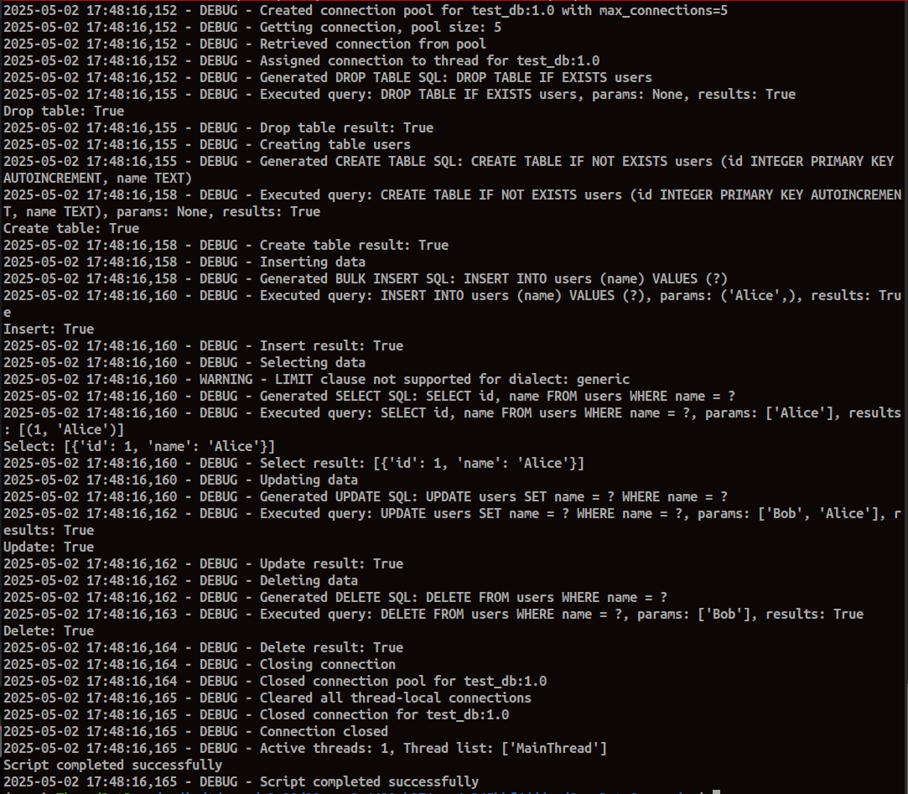
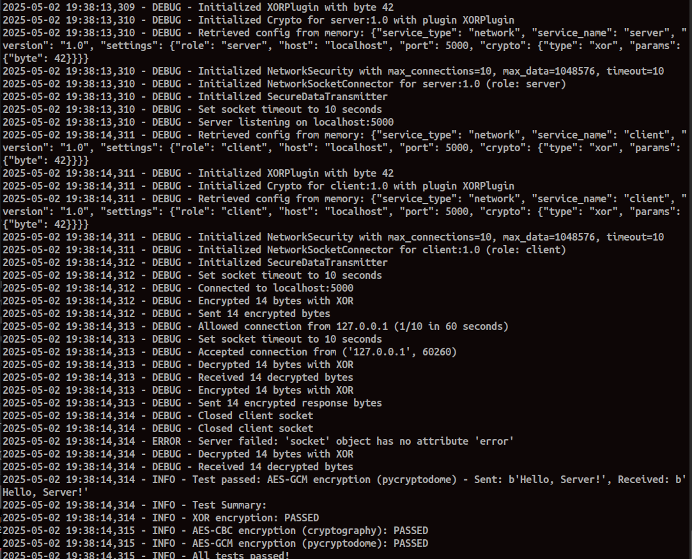

# Sane Data Commander

Sane Data Commander is a powerful Python application framework designed to streamline database management and operations across multiple database systems. It provides a unified interface for performing complex database tasks through modular, plug-and-play components. The Universal Database Connector (UDC) component serves as a database-agnostic layer, abstracting low-level database interactions and providing a virtual machine-like interface for seamless connectivity, configuration management, and SQL execution.

More dialects and databases are forthcoming in upcoming versions, so if you use this repo, stay tuned for updates! 📢

**TLDR**: Running `python Test_UDC.py` provides trivial usage examples from the top level and should produce output as shown below.

## Components

### Universal Database Connector (UDC)



The Universal Database Connector (UDC) is a Python library that provides a database-agnostic layer for Sane Data Commander, enabling seamless integration with multiple database systems (currently SQLite and MySQL, with more to come). It supports connection pooling, dialect-agnostic SQL generation, and configuration management, making it ideal for plugging into application frameworks requiring robust database operations.

#### Features
- **Universal Connectivity**: Supports SQLite and MySQL through a single interface, with plans for additional databases.
- **Connection Pooling**: Efficiently manages database connections with thread-safe pooling.
- **Dialect-Agnostic SQL**: Generates SQL queries compatible with different database systems using the `SQLMaker` class.
- **Configuration Management**: Loads and stores database configurations from CSV files into SQLite.
- **Thread-Safe Operations**: Ensures safe concurrent access with thread-local storage and locking.
- **Comprehensive Logging**: Detailed logs for debugging and monitoring operations.

#### Installation

1. Clone the Sane Data Commander repository:
   ```bash
   git clone https://github.com/ThreadDotRun/SaneDataCommander.git
   cd SaneDataCommander
   ```

2. Create a virtual environment (optional but recommended):
   ```bash
   python -m venv venv
   source venv/bin/activate  # On Windows: venv\Scripts\activate
   ```

3. Install dependencies:
   ```bash
   pip install -r requirements.txt
   ```

   Ensure you have the following dependencies in `requirements.txt` for the UDC:
   ```
   pymysql>=1.0.2
   ```

4. (Optional) Install database drivers:
   - For MySQL: Ensure a MySQL server is running.
   - For SQLite: No additional drivers needed (included with Python).

#### Usage

The `Test_UDC.py` script demonstrates how to use the UDC component to perform CRUD operations on a SQLite database within the Sane Data Commander framework. Below is an example:

1. Create a configuration CSV file (`configs.csv`):
   ```csv
   service_type,service_name,version,settings
   database,test_db,1.0,"{""driver"": ""sqlite3"", ""db_path"": ""test.db""}"
   ```

2. Run the test script:
   ```bash
   python Test_UDC.py
   ```

   This will:
   - Load configurations from `configs.csv`.
   - Create a `users` table.
   - Insert, select, update, and delete data.
   - Log all operations and close connections.

Example code snippet from `Test_UDC.py`:
```python
from UniversalDatabaseConnector import UniversalDatabaseConnector, DatabaseOperations

# Initialize connector and operations
connector = UniversalDatabaseConnector(db_path="configs.db")
connector.load_configs("configs.csv")
db_ops = DatabaseOperations(connector=connector, service_name="test_db", version="1.0")

# Create a table
db_ops.create_table(
    table_name="users",
    columns={"id": "INTEGER PRIMARY KEY AUTOINCREMENT", "name": "TEXT"},
    if_not_exists=True
)

# Insert data
db_ops.insert(table_name="users", data={"name": "Alice"})

# Select data
result = db_ops.select(table_name="users", columns=["id", "name"], where={"name": "Alice"})
print(result)
```

#### API Documentation

The UDC component exposes a robust API for database operations, configuration management, and connection handling. Below is detailed documentation for the key classes and methods, including input parameters, types, outputs, types, and expected data.

##### Class: `Distributor`
Manages configuration storage and retrieval using SQLite and CSV files.

- **`__init__(db_path: str = "configs.db") -> None`**
  - **Parameters**:
    - `db_path: str` - Path to the SQLite database for storing configurations (default: `"configs.db"`).
  - **Returns**: None
  - **Expected Data**: Initializes an SQLite database with a `configurations` table if it doesn’t exist. Logs initialization status.

- **`getConfigsFromDelimtedFile(file_path: str) -> bool`**
  - **Parameters**:
    - `file_path: str` - Path to a CSV file containing configuration data.
  - **Returns**: `bool` - `True` if configurations are loaded successfully, `False` otherwise.
  - **Expected Data**: CSV must have columns `service_type`, `service_name`, `version`, `settings` (JSON string). Configurations are stored in memory. Example CSV:
    ```csv
    service_type,service_name,version,settings
    database,test_db,1.0,"{""driver"": ""sqlite3"", ""db_path"": ""test.db""}"
    ```

- **`storeConfigsInSQLite() -> bool`**
  - **Parameters**: None
  - **Returns**: `bool` - `True` if configurations are stored in SQLite, `False` otherwise.
  - **Expected Data**: Stores in-memory configurations into the SQLite database’s `configurations` table.

- **`GetConfigureation(service: str, name: str, version: str) -> Optional[str]`**
  - **Parameters**:
    - `service: str` - Service type (e.g., `"database"`).
    - `name: str` - Service name (e.g., `"test_db"`).
    - `version: str` - Configuration version (e.g., `"1.0"`).
  - **Returns**: `Optional[str]` - JSON string of the configuration if found, `None` otherwise.
  - **Expected Data**: Retrieves configuration from memory or SQLite. Example output: `{"service_type": "database", "service_name": "test_db", "version": "1.0", "settings": {"driver": "sqlite3", "db_path": "test.db"}}`.

- **`addConfiguration(config: Dict[str, Any]) -> bool`**
  - **Parameters**:
    - `config: Dict[str, Any]` - Configuration dictionary with keys `service_type`, `service_name`, `version`, `settings`.
  - **Returns**: `bool` - `True` if configuration is added, `False` otherwise.
  - **Expected Data**: Adds configuration to memory and SQLite. Example input: `{"service_type": "database", "service_name": "test_db", "version": "1.0", "settings": {"driver": "sqlite3", "db_path": "test.db"}}`.

##### Class: `DBConnectionPool`
Manages a pool of database connections.

- **`__init__(max_connections: int = 10) -> None`**
  - **Parameters**:
    - `max_connections: int` - Maximum number of connections in the pool (default: `10`).
  - **Returns**: None
  - **Expected Data**: Initializes an empty connection pool with a thread-safe queue.

- **`initialize_pool(config: Dict[str, Any], driver: str) -> None`**
  - **Parameters**:
    - `config: Dict[str, Any]` - Configuration dictionary with `settings` key containing driver-specific connection details.
    - `driver: str` - Database driver (e.g., `"sqlite3"`, `"pymysql"`).
  - **Returns**: None
  - **Expected Data**: Populates the pool with connections based on the driver and configuration. Raises an exception on failure.

- **`get_connection() -> Any`**
  - **Parameters**: None
  - **Returns**: `Any` - A database connection object (e.g., `sqlite3.Connection`, `pymysql.connections.Connection`).
  - **Expected Data**: Retrieves a connection from the pool or creates a new one if the pool is empty and under capacity. Raises `RuntimeError` if no connections are available after a timeout.

- **`release_connection(conn: Any) -> None`**
  - **Parameters**:
    - `conn: Any` - Database connection object to return to the pool.
  - **Returns**: None
  - **Expected Data**: Returns the connection to the pool if space is available; otherwise, retains the connection without closing it. Logs warnings or errors if the pool is full or an issue occurs.

##### Class: `UniversalDatabaseConnector`
Handles database connections with thread-safe pooling.

- **`__init__(db_path: str = "configs.db") -> None`**
  - **Parameters**:
    - `db_path: str` - Path to the SQLite database for configurations (default: `"configs.db"`).
  - **Returns**: None
  - **Expected Data**: Initializes a `Distributor` instance and sets up thread-local storage for connections.

- **`load_configs(file_path: str) -> bool`**
  - **Parameters**:
    - `file_path: str` - Path to the CSV file with configurations.
  - **Returns**: `bool` - `True` if configurations are loaded and stored, `False` otherwise.
  - **Expected Data**: Loads configurations via `Distributor.getConfigsFromDelimtedFile` and stores them via `storeConfigsInSQLite`.

- **`connect(service_name: str, version: str = "1.0") -> bool`**
  - **Parameters**:
    - `service_name: str` - Name of the database service (e.g., `"test_db"`).
    - `version: str` - Configuration version (default: `"1.0"`).
  - **Returns**: `bool` - `True` if connection is established, `False` otherwise.
  - **Expected Data**: Creates a connection pool for the specified service and assigns a connection to the current thread. Supports drivers: `sqlite3`, `pymysql`.

- **`execute_query(query: str, params: Optional[Union[Tuple, List]] = None) -> Optional[Any]`**
  - **Parameters**:
    - `query: str` - SQL query to execute.
    - `params: Optional[Union[Tuple, List]]` - Query parameters for parameterized queries (default: `None`).
  - **Returns**: `Optional[Any]` - For `SELECT` queries, returns a list of rows; for other queries, returns `True` on success, `None` on failure.
  - **Expected Data**: Executes the query on the thread-local connection, commits on success, rolls back on failure. Example: For `SELECT id, name FROM users WHERE name = ?` with `params=["Alice"]`, returns `[ (1, "Alice") ]`.

- **`close() -> None`**
  - **Parameters**: None
  - **Returns**: None
  - **Expected Data**: Closes all connection pools and clears thread-local connections.

##### Class: `DatabaseOperations`
Provides high-level database operations (CRUD) using `SQLMaker`.

- **`__init__(connector: UniversalDatabaseConnector, service_name: str, version: str = "1.0", dialect: str = "generic") -> None`**
  - **Parameters**:
    - `connector: UniversalDatabaseConnector` - Instance of the connector.
    - `service_name: str` - Name of the database service.
    - `version: str` - Configuration version (default: `"1.0"`).
    - `dialect: str` - SQL dialect for `SQLMaker` (e.g., `"sqlite"`, `"mysql"`, `"generic"`; default: `"generic"`).
  - **Returns**: None
  - **Expected Data**: Initializes with a connector and a `SQLMaker` instance for the specified dialect.

- **`connect() -> bool`**
  - **Parameters**: None
  - **Returns**: `bool` - `True` if connection is established, `False` otherwise.
  - **Expected Data**: Calls `connector.connect` to establish a connection.

- **`create_table(table_name: str, columns: Dict[str, str], primary_key: Optional[Union[str, List[str]]] = None, if_not_exists: bool = True) -> bool`**
  - **Parameters**:
    - `table_name: str` - Name of the table to create.
    - `columns: Dict[str, str]` - Dictionary of column names to SQL data types (e.g., `{"id": "INTEGER", "name": "TEXT"}`).
    - `primary_key: Optional[Union[str, List[str]]]` - Column(s) for the primary key (default: `None`).
    - `if_not_exists: bool` - Add `IF NOT EXISTS` clause (default: `True`).
  - **Returns**: `bool` - `True` if table is created, `False` otherwise.
  - **Expected Data**: Creates a table with the specified columns and primary key.

- **`drop_table(table_name: str, if_exists: bool = True) -> bool`**
  - **Parameters**:
    - `table_name: str` - Name of the table to drop.
    - `if_exists: bool` - Add `IF EXISTS` clause (default: `True`).
  - **Returns**: `bool` - `True` if table is dropped, `False` otherwise.
  - **Expected Data**: Drops the specified table.

- **`create_index(index_name: str, table_name: str, columns: Union[str, List[str]], unique: bool = False) -> bool`**
  - **Parameters**:
    - `index_name: str` - Name of the index.
    - `table_name: str` - Table to create the index on.
    - `columns: Union[str, List[str]]` - Column(s) to index.
    - `unique: bool` - Create a unique index (default: `False`).
  - **Returns**: `bool` - `True` if index is created, `False` otherwise.
  - **Expected Data**: Creates an index on the specified columns.

- **`insert(table_name: str, data: Dict[str, Any]) -> bool`**
  - **Parameters**:
    - `table_name: str` - Name of the table to insert into.
    - `data: Dict[str, Any]` - Dictionary of column names to values (e.g., `{"name": "Alice"}`).
  - **Returns**: `bool` - `True` if insertion succeeds, `False` otherwise.
  - **Expected Data**: Inserts a single row into the table.

- **`bulk_insert(table_name: str, data: List[Dict[str, Any]]) -> bool`**
  - **Parameters**:
    - `table_name: str` - Name of the table to insert into.
    - `data: List[Dict[str, Any]]` - List of dictionaries with column names to values.
  - **Returns**: `bool` - `True` if insertion succeeds, `False` otherwise.
  - **Expected Data**: Inserts multiple rows. All dictionaries must have the same keys.

- **`select(table_name: str, columns: Union[str, List[str]] = "*", where: Optional[Dict[str, Any]] = None, order_by: Optional[Union[str, List[str]]] = None, limit: Optional[int] = None) -> Optional[List[Dict[str, Any]]]`**
  - **Parameters**:
    - `table_name: str` - Name of the table to select from.
    - `columns: Union[str, List[str]]` - Columns to select (default: `"*"`).
    - `where: Optional[Dict[str, Any]]` - Conditions for the `WHERE` clause (e.g., `{"name": "Alice"}`).
    - `order_by: Optional[Union[str, List[str]]]` - Columns to order by.
    - `limit: Optional[int]` - Maximum rows to return (not supported in all databases).
  - **Returns**: `Optional[List[Dict[str, Any]]]` - List of dictionaries with results, or `None` on error.
  - **Expected Data**: Example output: `[ {"id": 1, "name": "Alice"} ]`.

- **`update(table_name: str, data: Dict[str, Any], where: Optional[Dict[str, Any]] = None) -> bool`**
  - **Parameters**:
    - `table_name: str` - Name of the table to update.
    - `data: Dict[str, Any]` - Dictionary of column names to new values.
    - `where: Optional[Dict[str, Any]]` - Conditions for the `WHERE` clause.
  - **Returns**: `bool` - `True` if update succeeds, `False` otherwise.
  - **Expected Data**: Updates rows matching the `where` conditions.

- **`delete(table_name: str, where: Optional[Dict[str, Any]] = None) -> bool`**
  - **Parameters**:
    - `table_name: str` - Name of the table to delete from.
    - `where: Optional[Dict[str, Any]]` - Conditions for the `WHERE` clause.
  - **Returns**: `bool` - `True` if deletion succeeds, `False` otherwise.
  - **Expected Data**: Deletes rows matching the `where` conditions.

- **`close() -> None`**
  - **Parameters**: None
  - **Returns**: None
  - **Expected Data**: Closes all connection pools and thread-local connections.

##### Class: `SQLMaker`
Generates dialect-agnostic SQL statements.

- **`__init__(dialect: str = "generic") -> None`**
  - **Parameters**:
    - `dialect: str` - Database dialect (`sqlite`, `mysql`, `postgresql`, or `generic`; default: `"generic"`).
  - **Returns**: None
  - **Expected Data**: Initializes SQL generation for the specified dialect.

- **`create_table(table_name: str, columns: Dict[str, str], primary_key: Optional[Union[str, List[str]]] = None, if_not_exists: bool = True) -> str`**
  - **Parameters**: Same as `DatabaseOperations.create_table`.
  - **Returns**: `str` - SQL `CREATE TABLE` statement.
  - **Expected Data**: Example: `CREATE TABLE IF NOT EXISTS users (id INTEGER, name TEXT, PRIMARY KEY (id))`.

- **`drop_table(table_name: str, if_exists: bool = True) -> str`**
  - **Parameters**: Same as `DatabaseOperations.drop_table`.
  - **Returns**: `str` - SQL `DROP TABLE` statement.
  - **Expected Data**: Example: `DROP TABLE IF EXISTS users`.

- **`create_index(index_name: str, table_name: str, columns: Union[str, List[str]], unique: bool = False) -> str`**
  - **Parameters**: Same as `DatabaseOperations.create_index`.
  - **Returns**: `str` - SQL `CREATE INDEX` statement.
  - **Expected Data**: Example: `CREATE INDEX idx_name ON users (name)`.

- **`insert(table_name: str, data: Dict[str, Any]) -> Tuple[str, Tuple[Any, ...]]`**
  - **Parameters**: Same as `DatabaseOperations.insert`.
  - **Returns**: `Tuple[str, Tuple[Any, ...]]` - SQL `INSERT` statement and parameter values.
  - **Expected Data**: Example: `("INSERT INTO users (name) VALUES (?)", ("Alice",))`.

- **`bulk_insert(table_name: str, data: List[Dict[str, Any]]) -> Tuple[str, List[Tuple[Any, ...]]]`**
  - **Parameters**: Same as `DatabaseOperations.bulk_insert`.
  - **Returns**: `Tuple[str, List[Tuple[Any, ...]]]` - SQL `INSERT` statement and list of parameter tuples.
  - **Expected Data**: Example: `("INSERT INTO users (name) VALUES (?)", [("Alice",), ("Bob",)])`.

- **`select(table_name: str, columns: Union[str, List[str]] = "*", where: Optional[Dict[str, Any]] = None, order_by: Optional[Union[str, List[str]]] = None, limit: Optional[int] = None) -> Tuple[str, List[Any]]`**
  - **Parameters**: Same as `DatabaseOperations.select`.
  - **Returns**: `Tuple[str, List[Any]]` - SQL `SELECT` statement and parameter values.
  - **Expected Data**: Example: `("SELECT id, name FROM users WHERE name = ?", ["Alice"])`.

- **`update(table_name: str, data: Dict[str, Any], where: Optional[Dict[str, Any]] = None) -> Tuple[str, List[Any]]`**
  - **Parameters**: Same as `DatabaseOperations.update`.
  - **Returns**: `Tuple[str, List[Any]]` - SQL `UPDATE` statement and parameter values.
  - **Expected Data**: Example: `("UPDATE users SET name = ? WHERE id = ?", ["Bob", 1])`.

- **`delete(table_name: str, where: Optional[Dict[str, Any]] = None) -> Tuple[str, List[Any]]`**
  - **Parameters**: Same as `DatabaseOperations.delete`.
  - **Returns**: `Tuple[str, List[Any]]` - SQL `DELETE` statement and parameter values.
  - **Expected Data**: Example: `("DELETE FROM users WHERE name = ?", ["Alice"])`.

### Secure Network Communication

📢❗🚨 New!



The Secure Network Communication components provide a modular framework for encrypted data transmission over TCP sockets, integrating seamlessly with the Sane Data Commander ecosystem. These components reuse the `Distributor` class for configuration management, ensuring consistency with the UDC. The components are designed for client/server architectures, with encryption handled independently of the underlying socket connection.

#### Components Overview
- **Crypto**: Handles message cryptography using a configurable XOR-based encryption/decryption mechanism. Configurations (e.g., XOR byte) are managed via `Distributor`.
- **NetworkSocketConnector**: Establishes unencrypted TCP socket connections (client or server), configurable via `Distributor` for host, port, and role.
- **SecureDataTransmitter**: Manages encrypted data transmission over sockets created by `NetworkSocketConnector`, using `Crypto` to encrypt data before sending and decrypt after receiving.

#### Features
- **Configurable Cryptography**: Uses `Distributor` to manage encryption settings, currently supporting XOR-based encryption with a configurable byte.
- **Flexible Socket Connections**: Supports both client and server roles with configurable connection parameters (host, port).
- **Encrypted Data Transmission**: Ensures all data sent or received is encrypted, independent of the socket’s transport layer.
- **Thread-Safe Operations**: Leverages thread-safe configuration management via `Distributor`.
- **Comprehensive Logging**: Detailed logs for debugging and monitoring network and crypto operations.

#### Installation

1. Ensure the Sane Data Commander repository is cloned and dependencies are installed (see UDC Installation).
2. No additional dependencies are required for the Secure Network Communication components, as they use Python’s standard library (`socket`, `threading`).

#### Usage

The components are configured via a CSV file managed by `Distributor`. Below is an example of setting up a server and client for encrypted communication:

1. Create a configuration CSV file (`network_configs.csv`):
   ```csv
   service_type,service_name,version,settings
   network,server,1.0,"{""role"": ""server"", ""host"": ""localhost"", ""port"": 5000, ""crypto"": {""type"": ""xor"", ""byte"": 42}}"
   network,client,1.0,"{""role"": ""client"", ""host"": ""localhost"", ""port"": 5000, ""crypto"": {""type"": ""xor"", ""byte"": 42}}"
   ```

2. Run a server script (e.g., `server.py`):
   ```python
   from Distributor import Distributor
   from Crypto import Crypto
   from NetworkSocketConnector import NetworkSocketConnector
   from SecureDataTransmitter import SecureDataTransmitter

   distributor = Distributor(db_path="network_configs.db")
   distributor.load_configs("network_configs.csv")
   crypto = Crypto(distributor, service_name="server", version="1.0")
   connector = NetworkSocketConnector(distributor, service_name="server", version="1.0")
   transmitter = SecureDataTransmitter(connector, crypto)

   socket = connector.connect()
   transmitter.start_server(socket)
   ```

3. Run a client script (e.g., `client.py`):
   ```python
   from Distributor import Distributor
   from Crypto import Crypto
   from NetworkSocketConnector import NetworkSocketConnector
   from SecureDataTransmitter import SecureDataTransmitter

   distributor = Distributor(db_path="network_configs.db")
   distributor.load_configs("network_configs.csv")
   crypto = Crypto(distributor, service_name="client", version="1.0")
   connector = NetworkSocketConnector(distributor, service_name="client", version="1.0")
   transmitter = SecureDataTransmitter(connector, crypto)

   socket = connector.connect()
   response = transmitter.send_data(socket, "Hello, Server!".encode())
   print(f"Received: {response.decode()}")
   socket.close()
   ```

   This will:
   - Load configurations from `network_configs.csv`.
   - Establish a server or client socket connection.
   - Send/receive encrypted data using XOR encryption (byte 42).
   - Log all operations.

#### API Documentation

##### Class: `Crypto`
Handles message cryptography with configurable XOR-based encryption.

- **`__init__(distributor: Distributor, service_name: str, version: str = "1.0") -> None`**
  - **Parameters**:
    - `distributor: Distributor` - Instance of the `Distributor` class for configuration management.
    - `service_name: str` - Name of the network service (e.g., `"server"`, `"client"`).
    - `version: str` - Configuration version (default: `"1.0"`).
  - **Returns**: None
  - **Expected Data**: Loads crypto configuration (e.g., XOR byte) from `Distributor`. Raises `ValueError` if configuration is invalid.

- **`encrypt(data: bytes) -> bytes`**
  - **Parameters**:
    - `data: bytes` - Data to encrypt.
  - **Returns**: `bytes` - Encrypted data using XOR with the configured byte.
  - **Expected Data**: Applies XOR encryption. Example: `b"Hello" ^ 42` yields encrypted bytes.

- **`decrypt(data: bytes) -> bytes`**
  - **Parameters**:
    - `data: bytes` - Data to decrypt.
  - **Returns**: `bytes` - Decrypted data using XOR with the configured byte.
  - **Expected Data**: Reverses XOR encryption. Example: `(encrypted bytes) ^ 42` yields original `b"Hello"`.

##### Class: `NetworkSocketConnector`
Establishes unencrypted TCP socket connections.

- **`__init__(distributor: Distributor, service_name: str, version: str = "1.0") -> None`**
  - **Parameters**:
    - `distributor: Distributor` - Instance of the `Distributor` class for configuration management.
    - `service_name: str` - Name of the network service (e.g., `"server"`, `"client"`).
    - `version: str` - Configuration version (default: `"1.0"`).
  - **Returns**: None
  - **Expected Data**: Loads socket configuration (e.g., role, host, port) from `Distributor`. Raises `ValueError` if configuration is invalid.

- **`connect() -> socket.socket`**
  - **Parameters**: None
  - **Returns**: `socket.socket` - A connected TCP socket (server returns a client socket after accepting a connection).
  - **Expected Data**: For servers, binds and listens; for clients, connects to the specified host/port. Raises `socket.error` on failure.

##### Class: `SecureDataTransmitter`
Manages encrypted data transmission over sockets.

- **`__init__(connector: NetworkSocketConnector, crypto: Crypto) -> None`**
  - **Parameters**:
    - `connector: NetworkSocketConnector` - Instance of the socket connector.
    - `crypto: Crypto` - Instance of the crypto handler.
  - **Returns**: None
  - **Expected Data**: Initializes with references to connector and crypto instances.

- **`send_data(socket: socket.socket, data: bytes) -> bytes`**
  - **Parameters**:
    - `socket: socket.socket` - Connected socket to send data over.
    - `data: bytes` - Data to encrypt and send.
  - **Returns**: `bytes` - Decrypted response from the peer (empty for servers).
  - **Expected Data**: Encrypts data, sends it, and returns decrypted response (for clients). Example: Client sends `b"Hello"`, receives `b"Hi!"`.

- **`start_server(socket: socket.socket) -> None`**
  - **Parameters**:
    - `socket: socket.socket` - Server socket to accept connections.
  - **Returns**: None
  - **Expected Data**: Listens for client connections, receives encrypted data, decrypts, processes (e.g., echoes), and sends encrypted response. Runs until interrupted.

#### Testing

To verify the functionality of the Secure Network Communication components, you can create test scripts similar to the UDC tests:
- `Test_Crypto.py`: Tests encryption/decryption consistency using `Crypto`.
- `Test_Network.py`: Tests client/server communication using `NetworkSocketConnector` and `SecureDataTransmitter`.

Example test command:
```bash
python Test_Crypto.py
```

Ensure `network_configs.csv` is present and dependencies are installed.

#### Dependencies
- Python >= 3.8
- No additional dependencies (uses `socket`, `threading` from the standard library).

#### Project Structure (Secure Network Communication)
```
SaneDataCommander/
├── Crypto.py                 # Handles message cryptography
├── NetworkSocketConnector.py # Establishes TCP socket connections
├── SecureDataTransmitter.py  # Manages encrypted data transmission
├── network_configs.csv       # Sample configuration file
├── Test_Crypto.py            # Test script for Crypto
├── Test_Network.py           # Test script for network components
└── ...
```

## Contributing
Contributions to Sane Data Commander and its components are welcome! To contribute:
1. Fork the repository.
2. Create a new branch (`git checkout -b feature-branch`).
3. Make your changes and commit the code (`git commit -m 'Add feature'`).
4. Push to the branch (`git push origin feature-branch`).
5. Open a Pull Request.

Please ensure your contributions are sane and related to forwarding the concept of abstraction of services across platforms.

## License
This project is licensed under the Apache License 2.0. See the [LICENSE](LICENSE) file for details.

## Contact
For questions or issues, please open an issue on GitHub or contact me using GitHub's project forums.